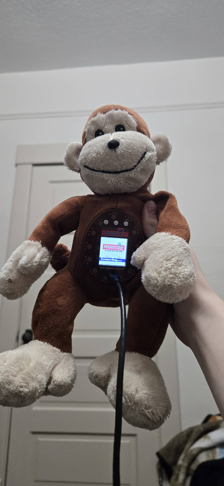
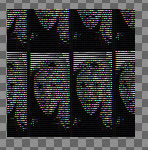
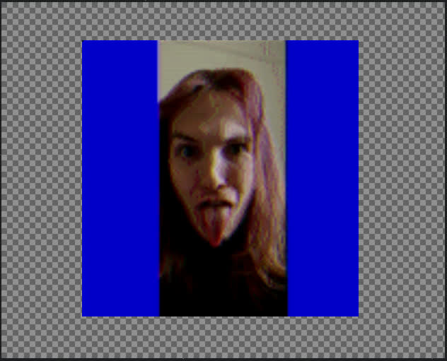

# How I hacked My Partner's Monkey

So a few days ago I was visiting my partner and they encountered this digital photoframe inside a monkey stuffed animal called a photokinz that was intended for little kids.
My partner remembered that it likely had a few photos of their late mother and a few other family members on the device, but they quickly discovered that one of the power cables on the device was unfortunately snapped.

In my attempt to be a good butch lesbian I quickly offered to repair the snapped wires since I was somewhat familiar with soldering and it would be a 2 minute job, but I also had offered to see if I could copy the images off of the stuffed animal (which just so happened to be a monkey.)

And thus starts the story of how I hacked my partner's monkey.

---

Eventually I brought the monkey home and started some research before I started seriously poking around the monkey. I wanted to see if anyone else had done any similar projects with this here simian (or other photo frames in the line) or even if the manufacturer had any documentation regarding these devices.
As it turns out, no. The manufacturer went defunct back in early 2008 (around the same time that my partner received the monkey) and that almost nobody had actually documented the existence of these photo frames at all.
I was prepared to not be able to see if the software used to put pictures onto the photokinz since I had rightfully assumed it was abandonware. Luckily I was surprised that upon connection that the device emulated a CD-ROM and exposed 2 files, an Autorun.inf and a Photokinz.exe.

Taking a cursory glance at the official software, I could see a preview of the images (with a resolution of 128x128 pixels) as I loaded them into the software, however an immediate snag was found since I could only upload images to the device but not download images from the device to my computer.

	

Okay, so there are a few approaches I can take here. The Autorun + Program are about 85kb in size, but the emulated CD/ROM is about 244mb in size. Maybe the images are written directly to the internal storage of this? (Doubtful, one of my friends figured that it was only an emulated filesystem rather than actually existing)

I could sniff USB traffic as well, clearly the data is being written to the program and is stored in memory *somewhere*, but USBPCap is a mystery to me.

I could also attempt to use Ghidra to see where images were stored in memory, but the big issue with either of those approaches were that I had no fucking clue what I was doing with either set of programs.

---
Okay, so let's go back to my initial hypothesis, that the images are hidden in the "CD/ROM", so I went ahead and make a disk image
`time sudo cat /dev/sr0 > dump.img`

`0.01s user 0.01s system 0% cpu 1:09:32.25 total`

Dear GOD this thing is slow as shit. I think it's operating at USB 1.0 speeds.

Anyways, searching through the dump in a hex editor didn't create a whole lot confidence since I couldn't see any image headers that I was familiar with, which indicated some sort of raw bitmap format to me. Fuck.

Well I wasn't having a whole lotta luck attempting to grab an isolated image, but I did have a bit of a brainwave. I uploaded a new image of my ugly mug to the device and then grabbed another disk image of the device, which was as every bit of painful as the first time.
I figured that if there were any changes to the internal storage then I could isolate those changes since I figured that they'd be the new image, and then I could figure out the image format from there.

I am finally getting somewhere. I was correct in my assumption that it only had 1 form of storage, and that I could use this to figure out the image format.
A friend and I (Thank you @WillyJL!)  figured that since this device was first made in about 2007, and that it probably lacks enough power to render PNGs or JPEGS (and because those headers weren't in my isolated data) I decided that it was probably some sort of RAW format or Bitmap.

So I wrote a python script that goes through a file and attempts to reconstruct my isolated image as bitmap.

It *technically* worked, I could absolutely see the general shape of my face and the expression I was making, however the weird interlacing and the repeating images wasn't encouraging.

I then spent a good few hours attempting to get my image aligned before I turned to Deepseek and told it to try a few different formats for a raw bitmap, because clearly I wasn't quite smart enough for this.

And it got it! 

I was dead on with the resolution, but it apparently used a somewhat obscure 16 bit encoding that I have never heard of.
#### RGB565
---
So now all that was left was to make it so that it could recover all of the images out of the dump.
I never figured out *how* the device knows where the pics are at in storage, WillyJL and I thinks it either has a look up table or it literally just spacing them out evenly

Regardless, I made the script so that it goes through the file byte by bye and attempts to reconstruct the images until EOF... and fucked up the endienness 

Easy fix, and I got all of the 40 some odd images out!

This isn't an elegant solution, but I had managed to successfully recover all of the images on the device onto a computer. I zipped them up and sent it on over to my partner.

Monkey Hacked!

